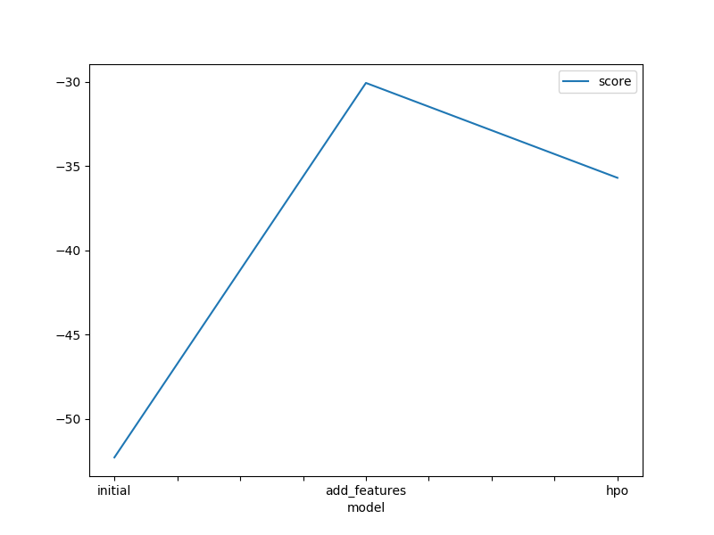
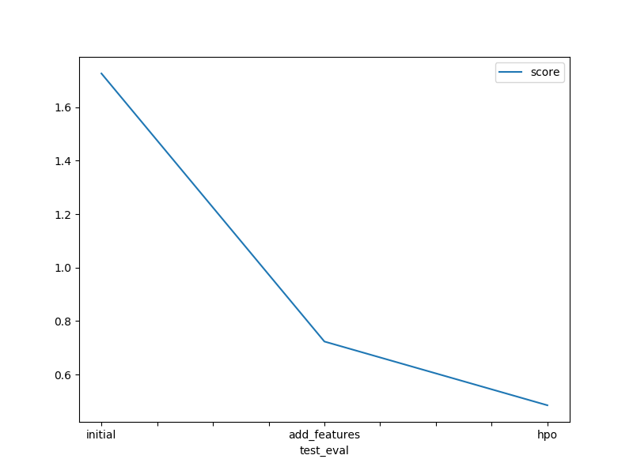

# Report: Predict Bike Sharing Demand with AutoGluon Solution
#### NGUYEN THE ANH

## Initial Training
### What did you realize when you tried to submit your predictions? What changes were needed to the output of the predictor to submit your results?
The model perform poorly. According to the guideline I should have perform a transformation for `count` that were <0 but I did not found such values in my run.

### What was the top ranked model that performed?
Using the score from `autogluon.leaderboard`, the `WeightedEnsemble_L3` from the add new feature step was the best model. However according to Kaggle score, the set of models from the hyperparameter tuning step was performing better on unseen data.

## Exploratory data analysis and feature creation
### What did the exploratory analysis find and how did you add additional features?
Using the histogram, I was able to find that `season` and `weather` were purely categorical data. I changed these columns to categorical and also split `datetime` into `year`, `month`, `day`, and `hour`, which provide Autogluon with addtional features to work with.

### How much better did your model preform after adding additional features and why do you think that is?
As the model is a regression model, the extra features are good indicators/ predictors for estimating the target value. Furthermore, before performing EDA, the datime data is not directly related to the target value in a regression model. After this step, 4 additional features were provided, and the result score is much better in my opinion. 

## Hyper parameter tuning
### How much better did your model preform after trying different hyper parameters?
Hyperparamter tuning result in a better result with unseen data (test data) overall comparing to suggested settings for autogluon (kaggle score of 0.48516 vs 0.72358). I found a strange thing where the highest performing model of the hyperparams tuning step does not work as well as the highest performing model of the new feature step when evaluating the `leaderboard` with each predictor. My guess is that the `predictor_new_features` is overffited to the `train` set.  

### If you were given more time with this dataset, where do you think you would spend more time?
I will start with a more comprehensive EDA, and then introduce additional features if possible. Finally I would try multiple set of hyperparameters and kwargs in Autogluon and try optimizing from there.  

### Create a table with the models you ran, the hyperparameters modified, and the kaggle score.
|model|hpo1|hpo2|hpo3|score|
|--|--|--|--|--|
|initial|N/A|N/A|N/A|1.72620|
|add_features|N/A|N/A|N/A|0.72358|
|hpo|'num_boost_round': 100,'num_leaves': lower=26, upper=66, default=36|'num_epochs': 10, 'learning_rate': 1e-4, 1e-2, 'activation':'relu', 'softrelu', 'tanh', 'dropout_prob': 0.0, 0.5|N/A|0.48516|

### Create a line plot showing the top model score for the three (or more) training runs during the project.

### Create a line plot showing the top kaggle score for the three (or more) prediction submissions during the project.

## Summary
In this project, I managed to build a regression model with Autogluon using the knowledge from Udacity Machine Learning Fundamentals course.
